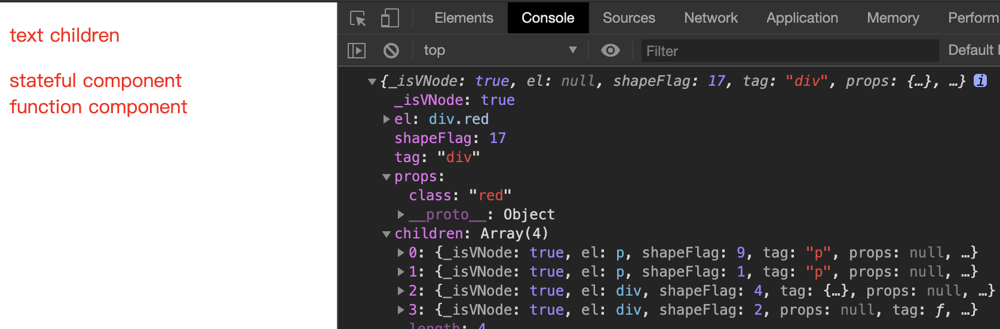

# 渲染 VNode 的 mount 函数
- [渲染 VNode 的 mount 函数](#渲染-vnode-的-mount-函数)
  - [mount 函数基本原理](#mount-函数基本原理)
  - [解决 `VNode` 的类型问题](#解决-vnode-的类型问题)
    - [渲染文本节点](#渲染文本节点)
    - [渲染标签节点](#渲染标签节点)
    - [渲染普通有状态组件](#渲染普通有状态组件)
    - [渲染函数式组件](#渲染函数式组件)
  - [设置 DOM 属性](#设置-dom-属性)
  - [渲染子节点](#渲染子节点)
  - [关联 `VNode` 及其 DOM](#关联-vnode-及其-dom)
  - [完整实现](#完整实现)
  - [完整示例](#完整示例)

得到 `VNode` 之后，我们需要把它渲染到页面上，这就是渲染器的 `Mount` 阶段。
## mount 函数基本原理
首先，新建一个 `render.ts` 文件，用来处理挂载相关代码。

`mount` 函数应该是这样，接收一个 `VNode` 作为参数，并把生成的 DOM 放进指定的容器 `container` 中，实现如下：
```js
function mount(vnode, container) {
  const el = document.createElement(vnode.tag)
  contianer.appendChild(el);
}
```
这就是挂载所做的核心事情，不过这里我们还缺少具体要实现的内容：
1. 根据不同 `shapeFlag` 生成不同 DOM
2. 设置 DOM 的属性
3. DOM 子节点的处理
4. 生成 DOM 后需将其赋值给 `vnode.el` 

## 解决 `VNode` 的类型问题

这里我们需要先了解一下普通有状态组件和函数式组件分别是什么，以下仅做理解用。
- 普通有状态组件
```js
const MyComponent = {
  render() {
    return h('div', null, 'stateful component')
  }
}
```

- 函数式组件
```js
function MyFunctionalComponent() {
  return h('div', null, 'function component')
}
```

我们根据 `vnode.shapeFlag` 的值来对各种类型 `VNode` 进行渲染操作。

```js
function mount(vnode, container) {
  if (vnode.tag === null) {
    mountTextElement(vnode, container)
  } else if (vnode.shapeFlag & ShapeFlags.ELEMENT) {
    mountElement(vnode, container)
  } else if (vnode.shapeFlag & ShapeFlags.STATEFUL_COMPONENT) {
    mountStatefulComponent(vnode, container)
  } else if (vnode.shapeFlag & ShapeFlags.FUNCTIONAL_COMPONENT) {
    mountFunctionalComponent(vnode, container)
  }
}

function mountTextElement(vnode, container) {
  ...
}

function mountElement(vnode, container) {
  ...
}

function mountStatefulComponent(vnode, container) {
  ...
}

function mountFunctionalComponent(vnode, container) {
  ...
}
```

### 渲染文本节点
```js
function mountTextElement(vnode, container) {
  const el = document.createTextNode(vnode.children)
  container.appendChild(el)
}
```

### 渲染标签节点
```js
function mountElement(vnode, container) {
  const el = document.createElement(vnode.tag)
  container.appendChild(el)
}
```

### 渲染普通有状态组件
普通有状态组件就是一个对象，通过 `render` 返回其 `VNode`， 因此其渲染方法如下：
```js
function mountStatefulComponent(vnode, container) {
  const instance = vnode.tag
  instance.$vnode = instance.render()
  mount(instance.$vnode, container)
  instance.$el = vnode.el = instance.$vnode.el
}
```

### 渲染函数式组件
函数式组件的 `tag` 为一个函数，返回值为 `VNode`，因此其渲染方法如下：
```js
function mountFunctionalComponent(vnode, container){
  const $vnode = vnode.tag()
  mount($vnode, container)
  vnode.el = $vnode.el
}
```

## 设置 DOM 属性

这里为了简化，这里我们假设 `props` 的每一项都是 DOM 的 `attribute`，所以我们可以这样做：
```js
function mountElement(vnode, container) {
  const el = document.createElement(vnode.tag)
  if(vnode.props){
    for(const key in vnode.props){
      const value = vnode.props[key]
      el.setAttribute(key, value)
    }
  }
  container.appendChild(el);
}
```
实际上，Vue 3 中 `props` 是一个扁平化的结构，它同时包含了 `property`、`attribute`、`event listener`等，每一项都需要单独处理，如下：
```js
props: {
  id: 'div',
  class: 'red',
  key: 'key1',
  onClick: this.onClick
}
```
简单解释 `property`、`attribute` 的区别就是：`attribute` 是 DOM 自带的属性，如：`id`、`class`；`property` 是自定义的属性名，如：`key`、`data-xxx`。

这里我们简单处理一下事件绑定：
```js
const isOn = (key) => key[0] === 'o' && key[1] === 'n'
function mountElement(vnode, container) {
  const el = document.createElement(vnode.tag)
  if (vnode.props) {
    for (const key in vnode.props) {
      const value = vnode.props[key]
      if (isOn(key)) {
        el.addEventListener(key.slice(2).toLowerCase(), value)
      } else {
        el.setAttribute(key, value)
      }
    }
  }
  container.appendChild(el);
}
```

## 渲染子节点
我们知道 `children` 可以是字符串或数组，因此实现方法如下：
```js
function mountElement(vnode, container) {
  const el = document.createElement(vnode.tag)

  // props
  if(vnode.props){
    for(const key in vnode.props){
      const value = vnode.props[key]
      el.setAttribute(key, value)
    }
  }

  // children
  if(vnode.children){
    if(typeof vnode.children === 'string'){
      el.textContent = vnode.children
    }else{
      vnode.children.forEach(child => {
        mount(child, el)
      })
    }
  }

  container.appendChild(el);
}
```

## 关联 `VNode` 及其 DOM
这个只需要增加一行代码即可，其它函数类似：
```js
function mountTextElement(vnode, container) {
  const el = document.createTextNode(vnode.children)
  vnode.el = el // （*）
  container.appendChild(el)
}
```

## 完整实现
现在我们实现了渲染器 `mount` 所有的功能，完整代码如下：
```js
function mount(vnode, container) {
  if (vnode.tag === null) {
    mountTextElement(vnode, container)
  } else if (vnode.shapeFlag & ShapeFlags.ELEMENT) {
    mountElement(vnode, container)
  } else if (vnode.shapeFlag & ShapeFlags.STATEFUL_COMPONENT) {
    mountStatefulComponent(vnode, container)
  } else if (vnode.shapeFlag & ShapeFlags.FUNCTIONAL_COMPONENT) {
    mountFunctionalComponent(vnode, container)
  }
}

function mountTextElement(vnode, container) {
  const el = document.createTextNode(vnode.children)
  vnode.el = el
  container.appendChild(el)
}

function mountElement(vnode, container) {
  const el = document.createElement(vnode.tag)

  // props
  if(vnode.props){
    for(const key in vnode.props){
      const value = vnode.props[key]
      el.setAttribute(key, value)
    }
  }

  // children
  if(vnode.children){
    if(typeof vnode.children === 'string'){
      el.textContent = vnode.children
    }else{
      vnode.children.forEach(child => {
        mount(child, el)
      })
    }
  }

  vnode.el = el
  container.appendChild(el)
}

function mountStatefulComponent(vnode, container) {
  const instance = vnode.tag
  instance.$vnode = instance.render()
  mount(instance.$vnode, container)
  instance.$el = vnode.el = instance.$vnode.el
}

function mountFunctionalComponent(vnode, container){
  const $vnode = vnode.tag()
  mount($vnode, container)
  vnode.el = $vnode.el
}
```

## 完整示例

现在我们可以检验一下写的是否正确，新建 [vdom.html](../../demo/vdom.html)，添加如下代码，并在浏览器中打开：
```js
import { h } from './h'
import { mount } from './render'

const MyComponent = {
  render() {
    return h('div', null, 'stateful component')
  }
}
function MyFunctionalComponent() {
  return h('div', null, 'function component')
}

const vdom = h('div', {
  class: 'red'
}, [
  h('p', null, 'text children'),
  h('p', null, null),
  h(MyComponent),
  h(MyFunctionalComponent)
])

console.log(vdom);
mount(vdom, document.querySelector("#app"))
```
浏览器渲染结果如下图，所有内容均正常显示：

 

至此，我们已经了解了 Vue 3 的基本渲染原理，并实现了一个简易版本的渲染器。

消化一下，下回继续～

[下一课 - 实现 patch 函数](./5.PATCH.md)
